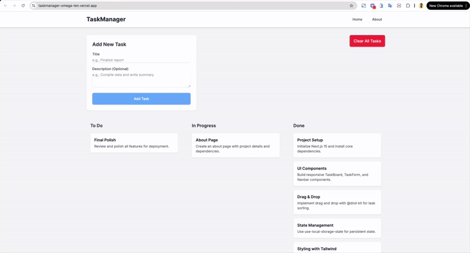

# Task Manager



A modern, mobile-responsive Task Manager application built with Next.js 15 and Tailwind CSS 4. This project demonstrates a clean, intuitive user interface for managing tasks on a Kanban-style board, complete with drag-and-drop functionality and local storage persistence.

**Live Demo:** [https://taskmanager-omega-ten.vercel.app/](https://taskmanager-omega-ten.vercel.app/)

## Core Features

- **Interactive Kanban Board**: A three-column layout ("To Do", "In Progress", "Done") for clear task organization.
- **Seamless Drag & Drop**: Smoothly reorder tasks within and between columns, powered by `dnd-kit`.
- **Add & Clear Tasks**: A simple and intuitive form to add new tasks, plus a one-click button to clear the board.
- **Persistent State**: Your tasks are saved directly in your browser's `localStorage`, so your session is always preserved.
- **Fully Responsive**: The UI gracefully adapts from a multi-column desktop layout to a single-column, tabbed view on mobile devices.

## Technical Implementation

This project was built to showcase proficiency in modern frontend technologies and best practices.

- **Framework**: Built with **Next.js 15** using the App Router, leveraging both Server Components for optimized initial loads and Client Components for rich interactivity.
- **Styling**: Styled with **Tailwind CSS v4**, using its CSS-first configuration approach with `@theme` for custom colors and design tokens.
- **Drag & Drop**: Implemented using **`dnd-kit`**, a lightweight and modern library for building performant and accessible drag-and-drop interfaces.
- **State Management**: Client-side state and `localStorage` integration are managed efficiently with the **`use-local-storage-state`** hook.
- **TypeScript**: Fully typed codebase for improved developer experience and code maintainability.

## Local Development

To run this project locally, follow these steps:

1.  **Clone the repository**:

    ```bash
    git clone <your-repo-url>
    cd task_manager
    ```

2.  **Install dependencies**:

    ```bash
    npm install
    ```

3.  **Run the development server**:
    ```bash
    npm run dev
    ```

Open [http://localhost:3000](http://localhost:3000) in your browser to see the application running.

## Mobile Responsiveness Notes

- On mobile devices, the Kanban board columns collapse into a single scrollable list with tabs to switch between "To Do", "In Progress", and "Done".
- Drag-and-drop is touch-friendly with larger tap targets for task cards.
- The layout is built with responsive Tailwind CSS classes (e.g., `sm:`, `md:`, `lg:`) to adapt from a stacked mobile view to a grid-based desktop view.
- Form inputs and buttons are designed to be large enough for easy use on mobile, with a minimum touch target size of 48px.

This project uses [`next/font`](https://nextjs.org/docs/app/building-your-application/optimizing/fonts) to automatically optimize and load [Geist](https://vercel.com/font), a new font family for Vercel.

## Learn More

To learn more about Next.js, take a look at the following resources:

- [Next.js Documentation](https://nextjs.org/docs) - learn about Next.js features and API.
- [Learn Next.js](https://nextjs.org/learn) - an interactive Next.js tutorial.

You can check out [the Next.js GitHub repository](https://github.com/vercel/next.js) - your feedback and contributions are welcome!

## Deploy on Vercel

The easiest way to deploy your Next.js app is to use the [Vercel Platform](https://vercel.com/new?utm_medium=default-template&filter=next.js&utm_source=create-next-app&utm_campaign=create-next-app-readme) from the creators of Next.js.

Check out our [Next.js deployment documentation](https://nextjs.org/docs/app/building-your-application/deploying) for more details.
